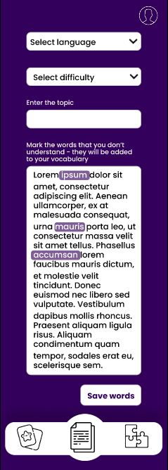
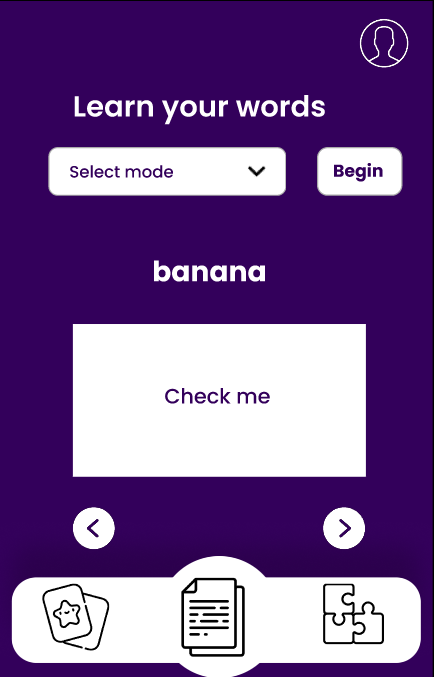
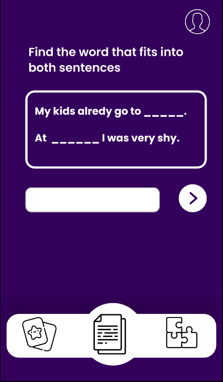
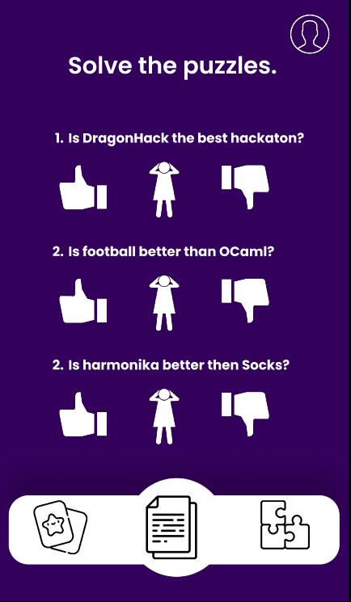
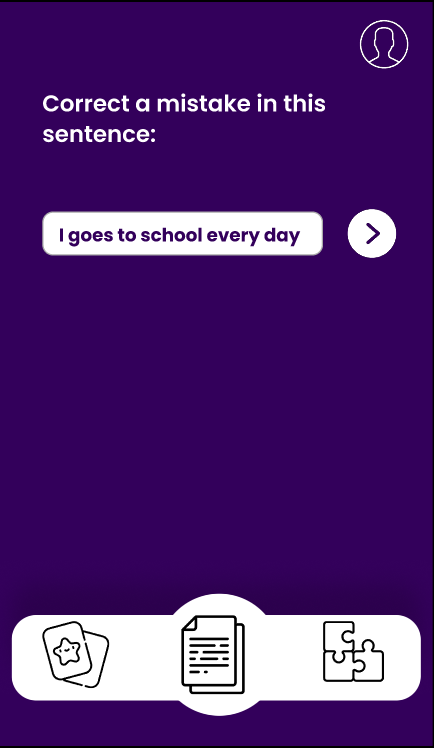

# SpeakEase DragonHack 2023

## About the project

A language learning app that strives to make learning a new language easier and more accessible to everyone. Unlike other language learning apps, we focus on the reading aspect of learning a new language. We achieve that by using a database of longer texts written in the language the user is learning. The user can then read the text and pick words or phrases that user wants to learn. After that, the user can learn these words or phrases via many learnig methods.

Learning methods include:

- Flashcards
- Fill in the blanks
- Quiz
- Fix the sentance

## Learning methods

We selected these approaches due to their proven effectiveness in language acquisition. Not only are they widely recognized for their efficiency, but they also align with our goal of simplifying the language learning process. Our app leverages these established methods, rather than attempting to create new ones, to ensure our users have the best tools at their disposal. We believe in utilizing what works best and making it accessible, which is why we opted for these strategies.

Before we can utilze any of these methods, we need to have a set of words or phrases that the user wants to learn. The user can select these words or phrases by highlighting them in the text. The user can then select the learning method user wants to use.

    

### Flashcards

    

Flashcards are a tried and true method of learning new words. They are simple and effective. Our app allows the user to create flashcards from the words or phrases user selected. The user can then review these flashcards at any time.

### Fill in the blanks

    

Fill in the blanks is another effective method of learning new words. It is also very simple and easy to use. Our app allows the user to create fill in the blanks questions from the words or phrases user selected. The user can then review these questions at any time.

### Quiz

Quizzing is a great way to test your knowledge. It is also a great way to learn new words. Our app allows the user to create quizzes from the words or phrases user selected. The user can then review these quizzes at any time.

    

### Fix the sentance

Fix the sentance is a great way to learn new words and phrases in context. It is also a great way to test your knowledge. Our app allows the user to create fix the sentance questions from the words or phrases user selected. The user can then review these questions at any time.

    

### Built with

Languages:

- MongoDB and Mongoose
- Express.js
- Vue.js
- Node.js

APIs:

- Google Books
- DeepL
- chatGPT
